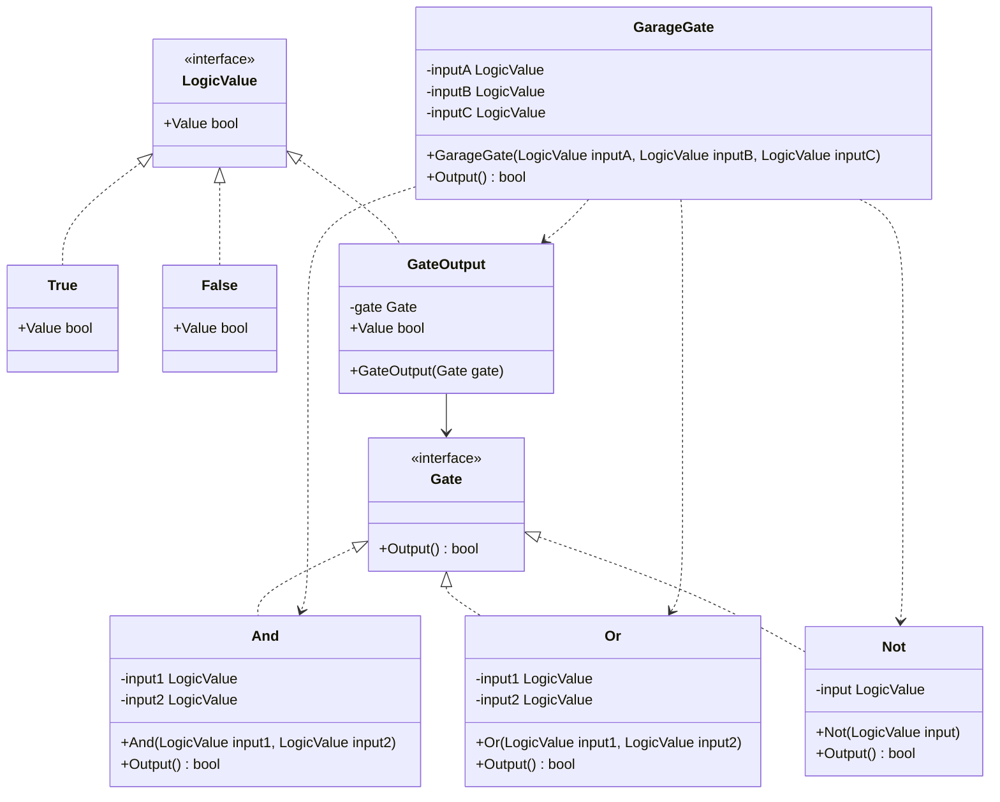

# Diagrama de clases

```mermaid
classDiagram

    class LogicValue {
        <<interface>>
        +Value bool
    }

    class Gate {
        <<interface>>
        +Output() bool
    }

    class True {
        +Value bool
    }

    class False {
        +Value bool
    }

    class GateOutput {
        -gate Gate
        +GateOutput(Gate gate)
        +Value bool
    }

    class And {
        -input1 LogicValue
        -input2 LogicValue
        +And(LogicValue input1, LogicValue input2)
        +Output() bool
    }

    class Or {
        -input1 LogicValue
        -input2 LogicValue
        +Or(LogicValue input1, LogicValue input2)
        +Output() bool
    }

    class Not {
        -input LogicValue
        +Not(LogicValue input)
        +Output() bool
    }

    class GarageGate {
        -inputA LogicValue
        -inputB LogicValue
        -inputC LogicValue
        +GarageGate(LogicValue inputA, LogicValue inputB, LogicValue inputC)
        +Output() bool
    }

    LogicValue <|.. True
    LogicValue <|.. False
    LogicValue <|.. GateOutput

    Gate <|.. And
    Gate <|.. Or
    Gate <|.. Not

    GateOutput --> Gate

    GarageGate ..> And
    GarageGate ..> Or
    GarageGate ..> Not
    GarageGate ..> GateOutput
```